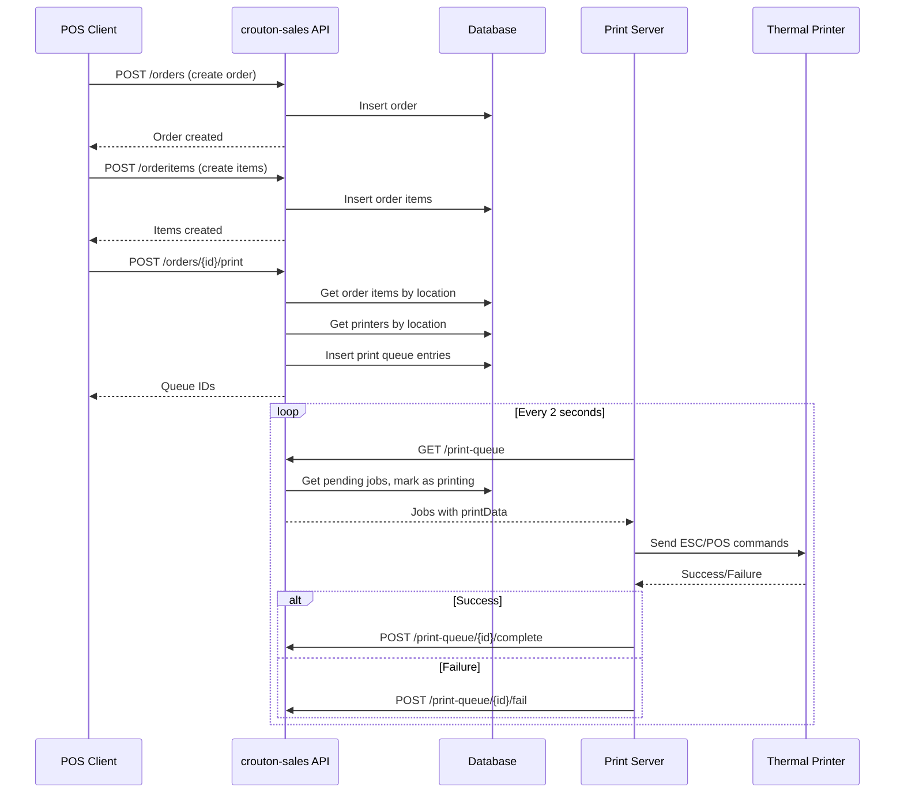

# Print Queue Implementation Briefing

## Summary

Implement automatic print functionality for crouton-sales that triggers when an order is completed. The external `fyit-pos-printer` server will poll for pending print jobs and send them to thermal printers.

## How It Works

```
┌─────────────────┐     ┌──────────────────┐     ┌─────────────────┐
│   POS Client    │────▶│  crouton-sales   │◀────│ fyit-pos-printer│
│   (checkout)    │     │   (print queue)  │     │  (print server) │
└─────────────────┘     └──────────────────┘     └─────────────────┘
                                                         │
                                                         ▼
                                                 ┌─────────────────┐
                                                 │ Thermal Printer │
                                                 │  (Epson TM-m30) │
                                                 └─────────────────┘
```

1. User completes checkout on POS client
2. Order + order items created in database
3. Print trigger endpoint generates print queue entries
4. `fyit-pos-printer` polls for pending jobs via API
5. Print server sends ESC/POS commands to thermal printers
6. Print server reports success/failure back to API

## Key Components

### Print Queue Table (`pos_printqueue`)

| Field | Type | Description |
|-------|------|-------------|
| id | text | Primary key |
| teamId | text | Team multi-tenancy |
| eventId | text | Event reference |
| orderId | text | Order reference |
| printerId | text | Target printer |
| locationId | text | Location (kitchen/bar) |
| status | integer | 0=pending, 1=printing, 2=completed, 9=failed |
| printData | text | Base64-encoded ESC/POS commands |
| errorMessage | text | Error message if failed |
| completedAt | timestamp | Completion time |

### Printer Types

- **kitchen**: Prints to specific location (kitchen/bar tickets) - items grouped by product location
- **receipt**: Prints customer receipt with all items and total price

### Print Modes

- **normal**: Kitchen/bar ticket (bold items, no prices, location header)
- **receipt**: Customer receipt (prices, totals, "Thank You" footer)

## API Endpoints

### For Print Server (API Key Auth)

| Endpoint | Method | Description |
|----------|--------|-------------|
| `/api/teams/[id]/print-queue` | GET | Poll for pending jobs (returns up to 10, marks as printing) |
| `/api/print-queue/[id]/complete` | POST | Mark job as completed |
| `/api/print-queue/[id]/fail` | POST | Mark job as failed with error |

### For POS Client (User Auth)

| Endpoint | Method | Description |
|----------|--------|-------------|
| `/api/teams/[id]/orders/[orderId]/print` | POST | Trigger print queue generation |

## Flow: Order to Print



## Print Queue Generation Logic

1. Fetch order items with product details (including locationId)
2. Group items by locationId
3. For each location:
   - Find ALL active printers of type `kitchen` for that location
   - Create queue entry for each printer (printMode: 'normal')
4. Find active printer of type `receipt` for the event
5. Create queue entry with all items (printMode: 'receipt', showPrices: true)

## Environment Variables

```env
PRINT_SERVER_API_KEY=<secure-random-key>
```

## Dependencies

```json
{
  "node-thermal-printer": "^4.5.0"
}
```

## Receipt Format Example

### Kitchen Ticket (normal mode)
```
        Event Name
       Location: BAR
────────────────────────
Order #42
Time: 12/9/2025, 3:45 PM
Client: John Doe

────────────────────────
2x  Beer
1x  Wine
    → Extra cold

────────────────────────


[CUT]
```

### Customer Receipt (receipt mode)
```
        Event Name
────────────────────────
Order #42
Time: 12/9/2025, 3:45 PM
Client: John Doe

────────────────────────
2x Beer               €8.00
1x Wine               €6.00

────────────────────────
TOTAL:               €14.00
────────────────────────
      Thank You!


[CUT]
```

## Files to Implement

| Priority | File | Action |
|----------|------|--------|
| 1 | `schemas/printers-schema.json` | Add `type` field |
| 2 | `schemas/printqueue-schema.json` | Create new schema |
| 3 | `layers/pos/collections/printqueue/` | Generate with Crouton |
| 4 | `server/utils/receipt-formatter.ts` | Create ESC/POS formatter |
| 5 | `server/utils/print-queue-service.ts` | Create queue generator |
| 6 | `server/api/teams/[id]/orders/[orderId]/print.post.ts` | Print trigger endpoint |
| 7 | `server/middleware/print-server-auth.ts` | API key auth middleware |
| 8 | `server/api/teams/[id]/print-queue/index.get.ts` | Polling endpoint |
| 9 | `server/api/print-queue/[id]/complete.post.ts` | Complete endpoint |
| 10 | `server/api/print-queue/[id]/fail.post.ts` | Fail endpoint |
| 11 | `layers/pos-views/app/composables/usePosOrder.ts` | Call print trigger |

## Reference Implementations

- Receipt Formatter: `/Users/pmcp/Projects/friendlypos/server/utils/receipt-formatter.ts`
- Print Queue Service: `/Users/pmcp/Projects/friendlypos/server/utils/print-queue-service.ts`
- Print Server: `/Users/pmcp/Projects/fyit-pos-printer/print_server.py`